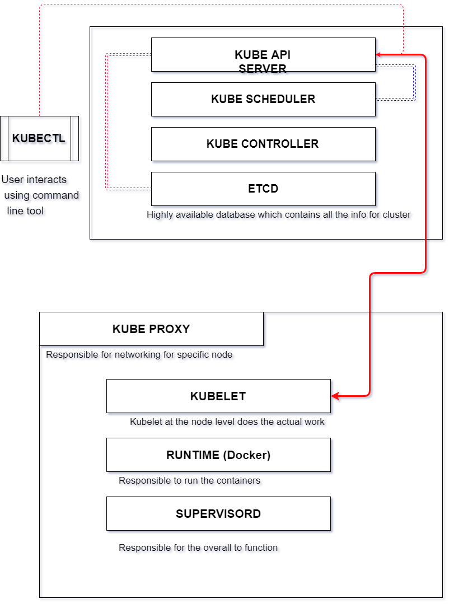

# Kubernetes Architecture.

- Kubernetes is made up multiple components.
- On a much higher level, kubernetes involves the master and slave aka minion nodes.

- Based on Master as well as the Minion nodes contents individually that fucntion in way for the entire cluster to work smoothly.

- Master:
    - Responsible to assign workload and contains the information about the overall cluster.

- Nodes/Slave/Minion:
    - Responsible for execution of the actual workloads or the execution of pods, service, deployments, containers.

In this case, if we watch carefully kubectl sends a request to lets say for creation of pods the request is reaches to the API server which gets all the information of the state of the cluster with the help of etcd and request scheduler to schedule the pods on the nodes.
